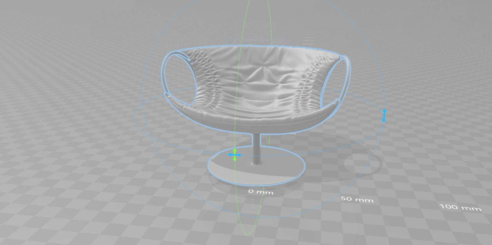

# Product configuration

Progetto di Avanzato Thomas e Castellano Astrid

## Il progetto

- Ci è stato chiesto di implementare un configuratore 3D per la visualizzazione di un modello tridimensionale con diversi materiali, in modo più realistico possibile. Si desidera che l'aspetto grafico di questo software ricordi un vero sito di e-commerce.
- Lo shading può essere implementato "a mano" oppure si possono usare i materiali già forniti da Three.js, a patto di trovare quale funzione BRDF utilizzano, e riscriverla in modo formale (non algoritmico).

## Pre-requisiti

- Saper utilizzare Three.js, importare modelli 3D, creare materiali.
- Conoscere i concetti base di shading con textures e mappatura UV, le diverse mappe per lo shading (normal, AO, diffusive, specular, roughness, displacement...).
- Conoscenza di base su illuminazione di prodotto.
- Saper creare interfacce grafiche per il web (html, css, js...).

## Goals 

- Creare un configuratore per applicare materiali realistici ad un oggetto 3D. Possibilmente materiali plausibili per il tipo di oggetto rappresentato (non auto di legno, sedie di carta ecc...).
- Creare un'interfaccia intuitiva che permetta di applicare i vari materiali in modo semplice e chiaro.
- Dare l'aspetto di un e-commerce professionale.

## Starting code

- Per l'implementazione del progetto non è stato fornito alcun codice di partenza, abbiamo comunque a disposizione gli esempi del corso che coprono la quasi totalità degli argomenti.

## Steps 

1. Clonato il progetto di partenza della repository del docente.
2. Progettazione dell'interfaccia e degli spazi designati alle varie attività nella pagina.
3. Ricerca di un modello 3D da utilizzare
4. Ricerca di materiali.
5. Ricerca su illuminazione di prodotto.
6. Costruzione della pagina con importazione del modello (momentaneamente senza materiali).
7. Implementazione dinamica di rotazione del modello (con limitazioni su asse x, non ruota su z, possiede dell'inerzia).
8. Aggiunta delle luci e posizionmento in modo coerente con il tipo di modello, in modo da illuminarlo il più uniformemente possibile.
9. Creazione dei materiali utilizzando le textures PBR ottenute dal sito [cc0 textures](<http://www.cc0textures.com>) e [MeshStandardMaterial](<http://www.inf.u-szeged.hu/~tanacs/threejs/docs/#api/en/materials/MeshStandardMaterial>).
10. Creazione del meccanismo di cambio dei materiali.
11. Rifintura dell'interfaccia grafica, aggiunta di funzionalità extra (scattare una foto e poterla salvare, centrare la geometria e visualizzazione in AR).
12. Individuazione della BRDF utilizzata nel codice sorgente di Three.js e riscrittura della stessa in forma matematica.


## Struttura del progetto

- Il file principale è "**configuratorAR.html**" e contiene l'intero progetto.
- **configuratorAR.js** è lo script di riferimento.
- **configurator-styleAR.css** contiene tutte le regole grafiche.
- Nella cartella **icons** sono presenti le immagini usate come icone o per bottoni.
- Nella cartella **js** è presente il codice sorgente di three.js, jQuery, JsARToolkit ed il suo marker in formato png.
- In "**obj**" è presente il modello 3D utilizzato, in formato obj (privo di materiali).
- La cartella **screenshots** contiene le varie catture di schermata fatte durante le varie fasi del progetto.
- In "**textures**" sono presenti tutti i materiali.


## Modello 3D

Abbiamo utilizzato un modello 3D di una sedia disegnata da [Moroso](<https://moroso.it>) e gentilmente ceduta per uso accademico (si prega quindi di non scaricare ed utilizzare in nessun modo il modello).

Modello




Dettagli del modello:
- 42828 vertici
- 79462 poligoni


## Luci

Le luci, di tipo spotlight, sono state posizionate nel seguente modo:


Sono tutte di colore bianco, con un'intensità pari ad 1.
Abbiamo inserito anche una luce ambientale, di intensità 0.6 (debole), per riempire le zone rimaste in ombra ed illuminare globalmente di più il nostro oggetto.

## BRDF utilizzata

Per questo progetto è stato usato il materiale [MeshStandardMaterial](<http://www.inf.u-szeged.hu/~tanacs/threejs/docs/#api/en/materials/MeshStandardMaterial>) di Three.js, di cui riportiamo la funzione BRDF, sia in forma matematica che algoritmica presente nel codice sorgente.

**Formalmente**

**BRDF**


**F**


**G**


**D**


**Nel codice sorgente**
```javascript
#define EPSILON 1e-6;
#define RECIPROCAL_PI 0.31830988618;

vec3 F_Schlick( const in vec3 specularColor, const in float dotLH ) {

	// Original approximation by Christophe Schlick '94
	// float fresnel = pow( 1.0 - dotLH, 5.0 );

	// Optimized variant (presented by Epic at SIGGRAPH '13)
	// https://cdn2.unrealengine.com/Resources/files/2013SiggraphPresentationsNotes-26915738.pdf
	float fresnel = exp2( ( -5.55473 * dotLH - 6.98316 ) * dotLH );

	return ( 1.0 - specularColor ) * fresnel + specularColor;

}

// Moving Frostbite to Physically Based Rendering 3.0 - page 12, listing 2
// https://seblagarde.files.wordpress.com/2015/07/course_notes_moving_frostbite_to_pbr_v32.pdf
float G_GGX_SmithCorrelated( const in float alpha, const in float dotNL, const in float dotNV ) {

	float a2 = pow2( alpha );

	// dotNL and dotNV are explicitly swapped. This is not a mistake.
	float gv = dotNL * sqrt( a2 + ( 1.0 - a2 ) * pow2( dotNV ) );
	float gl = dotNV * sqrt( a2 + ( 1.0 - a2 ) * pow2( dotNL ) );

	return 0.5 / max( gv + gl, EPSILON );

}

// Microfacet Models for Refraction through Rough Surfaces - equation (33)
// http://graphicrants.blogspot.com/2013/08/specular-brdf-reference.html
// alpha is "roughness squared" in Disney’s reparameterization
float D_GGX( const in float alpha, const in float dotNH ) {

	float a2 = pow2( alpha );
	float denom = pow2( dotNH ) * ( a2 - 1.0 ) + 1.0; // avoid alpha = 0 with dotNH = 1
	return RECIPROCAL_PI * a2 / pow2( denom );

}

// GGX Distribution, Schlick Fresnel, GGX-Smith Visibility
vec3 BRDF_Specular_GGX( const in IncidentLight incidentLight, const in GeometricContext geometry, const in vec3 specularColor, const in float roughness ) {

	float alpha = pow2( roughness ); // UE4's roughness
	vec3 halfDir = normalize( incidentLight.direction + geometry.viewDir );

	float dotNL = saturate( dot( geometry.normal, incidentLight.direction ) );
	float dotNV = saturate( dot( geometry.normal, geometry.viewDir ) );
	float dotNH = saturate( dot( geometry.normal, halfDir ) );
	float dotLH = saturate( dot( incidentLight.direction, halfDir ) );

	vec3 F = F_Schlick( specularColor, dotLH );
	float G = G_GGX_SmithCorrelated( alpha, dotNL, dotNV );
	float D = D_GGX( alpha, dotNH );

	return F * ( G * D );

}
```


## Textures PBR

Sono state prese dal sito [cc0 textures](<https://cc0textures.com/>) e scelte in base al modello a cui applicarle.
Le textures utilizzate per i vari materiali (per comodità solo le componenti diffusive) sono le seguenti:

Tessuti

<!--
--><!--
--><!--
--><!--
-->

Pelli

<!--
-->

Metalli

<!--
--><!--
-->

Legni

<!--
-->


## Applicazione dei materiali

Abbiamo reso possibile applicare diversi materiali a diverse parti della sedia:
- 5 tessuti e 2 tipi di pelle per la seduta.
- 3 metalli e 2 tipi di legno per braccioli e basamento, tra loro indipendenti.

Alcune combinazioni:


## Interfaccia

L'interfaccia grafica è molto essenziale e prevede il canvas per il rendering di Three.js a schermo pieno, con un menù laterale a scomparsa in cui è possibile selezionare i materiali ed eventualmente procedere con l'acquisto.


## Funzionalità extra

Per arricchire l'esperienza dell'utente sono state aggiunte 3 funzionalità extra non richieste:
- Possibilità di riportare il modello e la vista nella posizione originale con un bottone apposito, ad esempio dopo essersi avvicinati o aver ruotato il modello.
- Possibilità di poter scattare una foto alla configurazione attuale e poterla salvare sul dispositivo.
- Possibilità di vedere il modello in AR tramite webcam o fotocamera, dopo aver scaricato l'apposito marker.

Snapshot


Augmented reality


## Tecnologie utilizzate
- **HTML** per la creazione della pagina, dei canvas per il rendering e la reltà aumentata.
- **CSS** per gli stili grafici (senza librerie o framework).
- **Javascript** per le funzionalità come ascoltatori di eventi, creazione di elementi dinamici nel DOM, possibilità di scaricare il frame "fotografato".
- **Three.js** per la parte 3D.
- **JsARToolkit** per il tracking del marker nella realtà aumentata.
- **JQuery** per l'animazione di flash della fotografia (evitando così di scrivere molto codice javascript).

## Problemi riscontrati
1. La centratura del modello si comporta in modo inaspettato per alcune rotazioni (negative minori di -PI).

	- **Motivo**: il valore di rotazione di un oggetto attorno ad un asse, in Three.js, è espresso con un float, e può essere positivo o negativo. Per cui, ad una stessa rotazione, possono corrispondere valori diversi (ad esempio 90deg = -270deg = 450deg = ...).

	- **Causa**: impostazione errata dei controlli sui valori di rotazione. Ho cercato di modulare il valore di rotazione nell'intervallo [-PI, PI], ma in alcuni casi si eccede da tale range (problema ancora da risolvere).

	- **Soluzione**: esprimere la rotazione solo nell'intervallo [-PI, PI] (non interessa sapere che l'oggetto ha compiuto più giri, ma solo la sua posizione finale attorno all'asse di rotazione).

2. Dopo vari cambi di materiale e utilizzo dell'applicativo (per un tempo maggiore di circa 10 min) si termina la memoria riservata dal browser.

	- **Causa**: i frame vecchi vengono mantenuti dopo essere stati visualizzati, grazie al comando nel renderer:

		```javascript
		preserveDrawingBuffer: true
		```
		Ciò è necessario se voglio scattare una istantanea mentre sto configurando, e lo posso fare solo evitando di scartare i frame una volta visualizzati.
	
	- **Possibile soluzione**: trovare un meccanismo per svuotare periodicamente il buffer del renderer (da verificare).


## Conclusioni

### Adattabilità
Idealmente, abbiamo cercato di costruire un configuratore semplice ed essenziale, che possa essere integrato in qualsiasi sito web pre-esistente in vari modi:
- Inserendolo in un frame (o iframe) all'interno di una pagina.
- Utilizzandolo come finestra full screen temporanea (che svanisca una volta confermata la configurazione o effettuato l'acquisto).
- Utilizzandolo come pagina di passaggio: **selezione prodotto** -> **configurazione** -> **conferma pagamento**

La scelta di colori neutri ed assenza di immagini di sfondo aiuta a dare l'aspetto di un prodotto generico, quindi non appartenente ad una categoria di utente e di mercato ben precise.
Grazie a queste scelte il configuratore si adatta a diverse grafiche e colori senza contrastare troppo.

### Modello
Purtroppo il modello fornitoci è abbastanza elaborato e computazionalmente pesante. Le prestazioni su un dispositivo medio (PC o portatile) sono comunque buone (60fps).
Su dispositivi datati o alcuni smartphone però si potrebbe scendere sotto i 20-30fps dando risultati poco professionali.

### Progetto
Il progetto è un'opportunità per applicare quanto studiato ed appreso, ma in un'ottica professionale.
Ci ha dato modo di comparare il nostro lavoro con sistemi già esistenti, aiutandoci a capire in quale direzione continuare la pratica e lo studio della materia.
E' stato di stimolo alla creatività, ma anche all'immedesimazione nell'utente per comprendere le possibili esigenze, e cercare di soddisfarle.